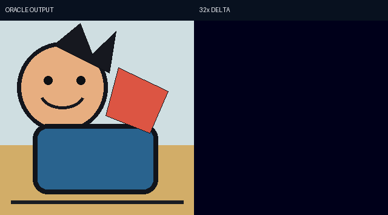

# Public Visual Results

All images on this page are procedurally generated and copyright-independent.

The comparison is a software demonstration, not evidence of historical visual fidelity. B and D3 use documented public mask approximations.

The second panel amplifies numerical difference by 32× to make localization inspectable. The native Oracle blind-review conclusion remains no visible difference.
